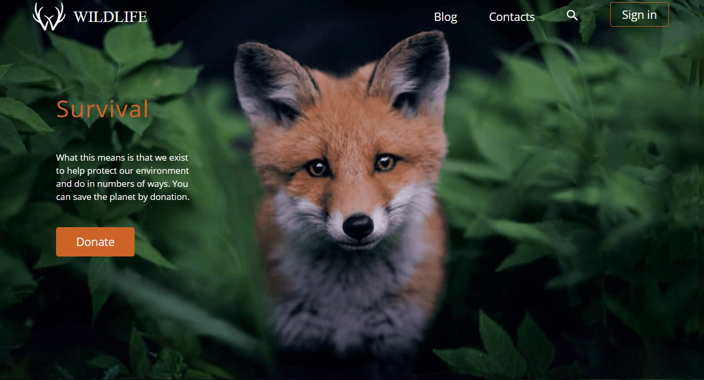

## Task 2. Wildlife от [RSS School](https://rs.school/)

### **Проект  Wildlife [(готовый)]( https://marinatwice82.github.io/wildlife/)**

Сверстать страницу согласно макету:

### [Figma](https://www.figma.com/file/dJoqHi1YHTLR06PPEeCc7t/Wildlife?node-id=0%3A1)

Точное совпадение с макетом не требуется. Основное требование - визуальное сходство вёрстки и страницы макета. Допускается отклонение от макета на 5px по горизонтали и 10px по вертикали.

Работающий слайдер не требуется, но если можете - сделайте (слайдер сделан).

### [Описание задания](https://rolling-scopes-school.github.io/stage0/#/stage0/tasks/wildlife)

